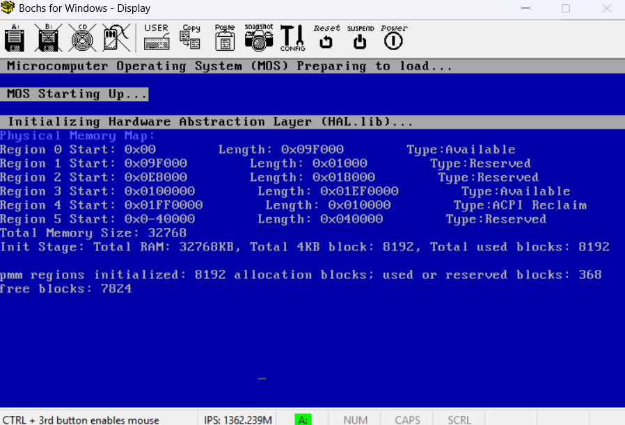

# BrokenThorn OS Development Series (2025 Edition)

This repository is a modernized walkthrough of the legendary **BrokenThorn OS Development Series** — one of the most influential tutorials for beginner operating system developers.  

The goal of this project is to make the series **more current and runnable in 2025**, while preserving the structure and learning value of the original work. Each tutorial’s code has been carefully adapted, updated, and tested to run on today’s toolchains and environments.

---

## 📖 About This Project

- Each tutorial corresponds to a **Git branch** in this repository.  
  - Example: `Virtual_Memory_Manager` contains the code and notes for the Paging tutorial.  
- The repository includes:
  - **Demo Code with fix** which include the demo code provided from the tutorial with self-amendment which is runnable if you follow 
  - **Explanations and commentary** to clarify why certain changes are made.
- Current progress: **Virtual_Memory_Manager** (later tutorials will be added branch by branch).

---

## 🙏 Credits

A huge appreciation goes to **BrokenThorn Development** for creating such an excellent OS tutorial series. It has inspired countless developers to dive into OSDev, and this repository is intended as a respectful continuation and modernization of their great work.  

---

## 🚀 How to Use

**Follow The Tutorial**
- If there is any trouble on running the demo code, clone the branch from the repo

- i.e. Physical Memory Manager:
   ```bash
   git clone https://github.com/yourusername/brokenthron-osdev-2025.git
   git checkout Physical_Memory_Manager


I will also add a description file in each tutorial branch to summeraise tutorial content and problems faced during the tutorial development and the approach I solve it.  


## Set up from Bootloader to Kernel (Tutorial 12 - 13)
There is a a loophole (I guess :( ) in the tutorial website which the kernel Setup for MSVC++ 2005 is not linked to the series if you follow along.... Thanks to Google and ChatGPT, I have a totally different setup which spends me around 2 days to making the code runnable.

If you want to follow the set up for the tutorial, here is the link : http://www.brokenthorn.com/Resources/OSDevMSVC.html

Here I would provide the tools for me to compile the code in my branch if You love to follow along. (I am developing under Window 11 OS)

### Tools:
- Bochs 3.0
- MSYS32 MINGW64 Shell (Run the compile code)
- WinImage (For importing Kernel code (KRNL32.exe)and stage2 (KRNLDR.SYS) into a floppy which has a FAT12 File System)
- x86 Native Command Prompt
- nasm 


### Steps:
1. To compile the kernel code (x86 Native Command Prompt): 
```bash 
cl /c /nologo /GS- /GR- /EHs- /Oi /Zl /D__KERNEL__ /DARCH_X86 /D_DEBUG /I..\Header ^
entry.cpp main.cpp DebugDisplay.cpp mmngr_phys.cpp exception.cpp panic.cpp ^
..\Lib\cstd.cpp ..\Lib\string.cpp ..\Lib\stdio.cpp ^
..\Hal\cpu.cpp ..\Hal\idt.cpp ..\Hal\gdt.cpp ..\Hal\Hal.cpp  ..\Hal\pic.cpp ..\Hal\pit.cpp 
```

/D for stands for MARCO , and other flag to create a freestanding Code

2. To link the .obj file (x86 Native Command Prompt):
``` bash 
link /BASE:0x00100000 /nologo /subsystem:native /entry:kernel_entry /nodefaultlib /align:512 ^
/filealign:512 /out:KRNL32.exe ^
cstd.obj string.obj cpu.obj entry.obj mmngr_phys.obj ^
gdt.obj hal.obj idt.obj main.obj pic.obj pit.obj DebugDisplay.obj
```
In this stage, you have successfully compile and link the kernel code.

3. Compile Stage1 and Stage2 (VS Code or IDE u like )
```bash 
Stage 1: 
nasm -fbin boot1.asm -o boot1.bin

Stage 2: 
nasm -fbin Stage2.asm -o KRNLDR.SYS

```

4. Put two things 1. KRNLDR.SYS 2. KRNL32.exe together in a floppy ISO image (WinImage)

**Use WinImage:**
1. Create a new image and specify size (1.44MB)

2. Import KRNLDR.SYS and KRNL32.exe

3. Save the new floppy image

Now we have our Stage 2 and kernel inside the floppy image, what we left ...... Yes the bootloader. The last step is to inject our bootloader (i.e. boot1.bin) into the first 512 bytes of our floppy disk.

5. Inject Bootloader

To do this, use the command below in a bash terminal (VS Code or IDE u like )
```bash
dd if=./SysBoot/Stage1/boot1.bin of=floppy.IMA bs=512 count=1 conv=notrunc
```

YEAHHHHHH! We made it. To run the OS, open the MSYS32 MINGW64 Shell, cd to the root directory of the project, then hit the last command 
```bash 
/c/Users/User/Desktop/bochs-3.0/bochs-3.0/bochs.exe -f bochsrc.txt -dbg

```
If you want to run normal, just ignore the `-dbg`





Last Big Tip: Learn to debug in bochs is useful !! Don't think this is silly, I have also tried couple time stepping in every instruction just to check why i can't run the code in Tutorial 12 and 13. (Yeah I am a stupid person)

The road of developing OS is tough, but is worth everything once you solve it. Be patience :0) and feel free to discuss with me in the github discussion or directly send email to me (eltonwong32@gmail.com) if there are any problem and improvement for this repo. (I know the set up and could be better.)


